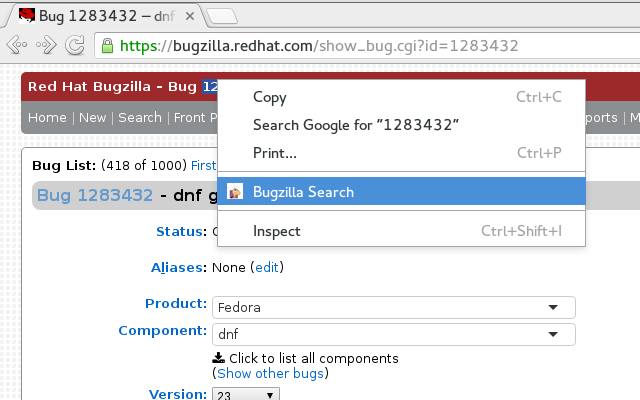

Bugzilla Search
===============

*Search Bugzilla using Chrome Context Menu*

Context menu search option for Bugzilla. This extension allow users to search any highlighted bugzilla ID on bugzilla.redhat.com.

Users will highlight the bugzilla they wish to know more about.

In the chrome browser, right-click the highlighted bugzilla id, before selecting the 'Bugzilla Search' option from the context menu. After this, users will be redirected to the relevant bugzilla page.

* Screenshot

